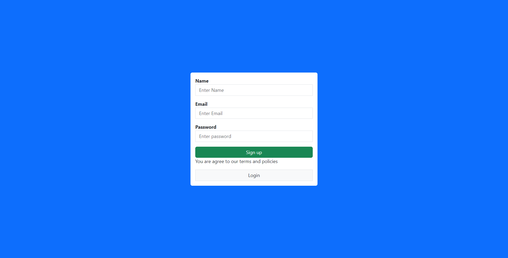
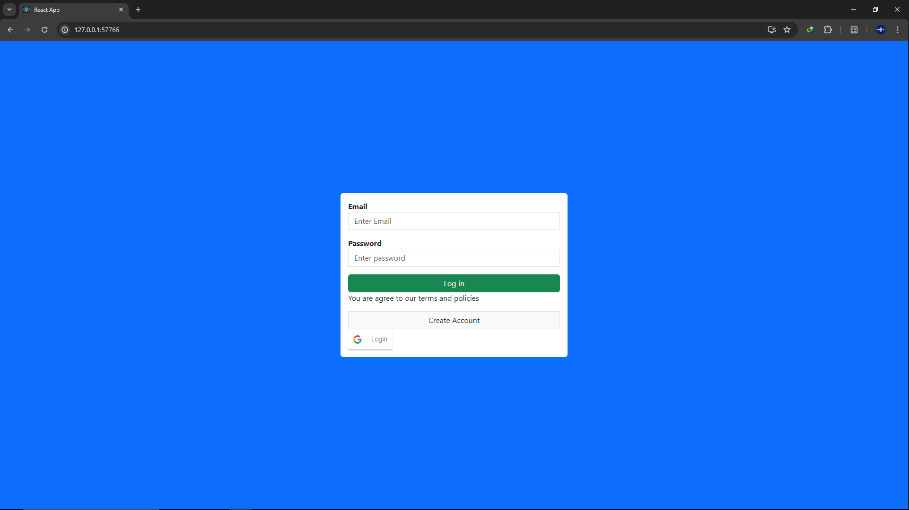

# CCM Component Design: User Auth & Comments

## Overview
This project implements user authentication and a comments system using AWS Lambda and AWS REST API to transform a monolithic application into multiple microservices. This design ensures that the failure of one service does not affect the others. The deployment is handled using Docker Compose and Kubernetes.

## Features
- **User Authentication**: Secure user registration and login functionalities.
- **Comments System**: Allows users to post and manage comments.
- **Microservices Architecture**: Each service operates independently to enhance reliability and scalability.

## Technologies Used
- **Backend**: AWS Lambda, AWS REST API
- **Frontend**: React, Bootstrap
- **Database**: Managed by AWS services
- **Deployment**: Docker Compose, Kubernetes

## Project Structure
- **APIs**: Three separate APIs for handling user authentication, comments, and other functionalities as per CCM component design.
- **Database**: Distributed database setup according to microservice architecture principles.

## Setup and Deployment
1. **Clone the repository**
    ```sh
    git clone https://github.com/Big-Leu/CompoConnect.git
    cd frontend
    npm i
    npm run dev
    ```

2. **Configure AWS Services**
    - Set up AWS Lambda functions for different services.
    - Configure AWS REST API to route requests to the corresponding Lambda functions.

3. **Docker Setup**
    - Ensure Docker and Docker Compose are installed on your machine.
    - Build and run the Docker containers.
    ```sh
    docker-compose up --build
    ```

4. **Kubernetes Deployment**
    - Ensure Kubernetes is installed and configured on your machine.
    - Apply the Kubernetes configuration files.
    ```sh
    kubectl apply -f myapp.yaml
    ```

5. **Environment Variables**
    - Set up necessary environment variables for AWS credentials and database connections in a `.env` file.

## Usage
- **User Authentication**
    - Endpoint: `/api/auth`
    - Methods: `POST /register`, `POST /login`

- **Comments**
    - Endpoint: `/api/comments`
    - Methods: `GET /`, `POST /`, `DELETE /:id`

## Screenshot
### Sign-up Page

### Login Page

### Home Page


## Contributing
Contributions are welcome! Please fork the repository and submit a pull request for any improvements or bug fixes.

## Contact
- **Abhishek Rawat**
    - Email: [bigleu88@gmail.com](mailto:bigleu88@gmail.com)
    - GitHub: [Big-Leu](https://github.com/Big-Leu)
    - LinkedIn: [Abhishek Rawat](https://www.linkedin.com/in/abhishek-rawat-25165628a/)

## Acknowledgments
Special thanks to the contributors and the open-source community for their support and tools that made this project possible.
